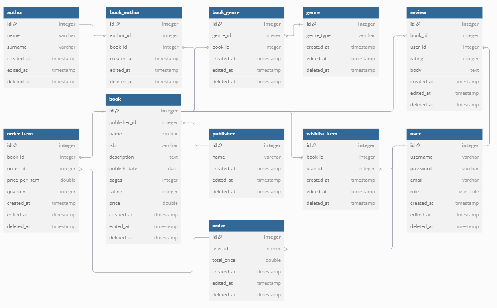
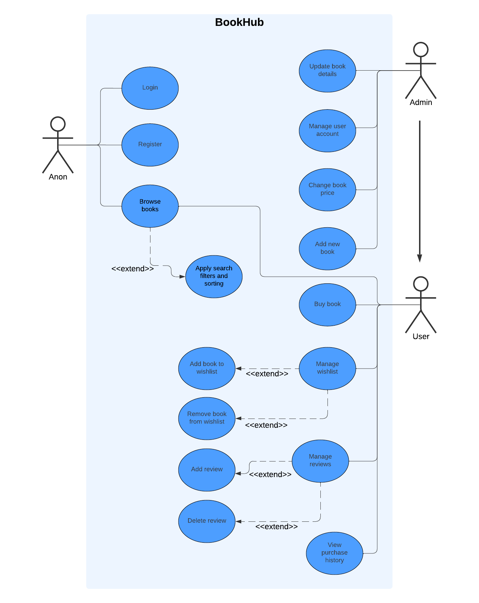

# BookHub I guess
Eshop for books, that will guess what book you want to read.

## Database
- We are using SQLITE, may be changed in the future
- Init database
```sh
dotnet ef database update --project "DAL.SQLite.Migrations"
```
- Add migration
```sh
dotnet ef migrations add <Migration-Name> --project "DAL.SQLite.Migrations"
dotnet ef database update --project "DAL.SQLite.Migrations"
```

## Code formatter
The project uses [Csharpier](https://csharpier.com/docs/About).

### Console
To run the formatter in console:
```sh
dotnet csharpier .
```

### Visual Studio
See Csharpier plugin for [Visual Studio](https://marketplace.visualstudio.com/items?itemName=csharpier.CSharpier).

### Rider
See Csharpier plugin for [Rider](https://plugins.jetbrains.com/plugin/18243-csharpier).

## Diagrams
### Entity Relationship Diagram


### Use-case diagram

