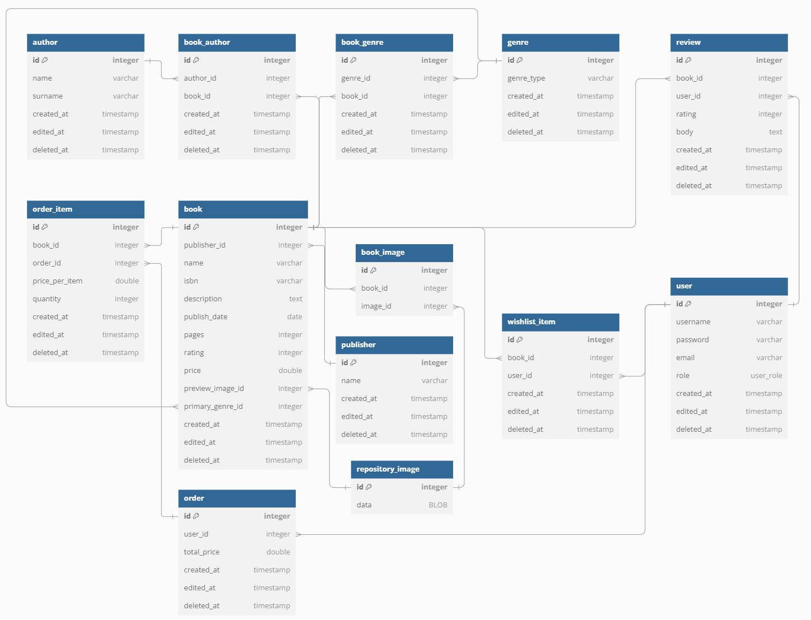

# BookHub I guess
Eshop for books, that will guess what book you want to read.

## Database
- We are using SQLITE, may be changed in the future
- Init database
```sh
dotnet ef database update --project "DAL.SQLite.Migrations"
```
- Add migration
```sh
dotnet ef migrations add <Migration-Name> --project "DAL.SQLite.Migrations"
dotnet ef database update --project "DAL.SQLite.Migrations"
```

## Diagrams
### Entity Relationship Diagram

